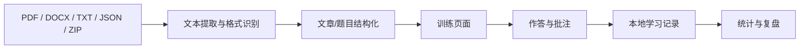

# LR-考研英语真题特训

> 面向 Android 平板横屏场景的本地优先考研英语阅读训练工具。重点解决“真题阅读、批注、计时、复盘和长期统计分散在不同工具里”的问题。

[](https://developer.android.com/)
[](https://vite.dev/)
[](https://capacitorjs.com/)
[](.github/workflows/build-android.yml)

## 项目定位

这是一个为平板学习流程设计的工程化练习项目，而不是单纯的题库页面。项目围绕三个目标展开：

1. **降低阅读训练的工具切换成本**：文章、题目、批注、计时、答案与解析集中在同一界面。
2. **让训练过程可复盘**：记录正确率、重复练习、学习计划和做题笔记。
3. **保持数据可控**：核心学习记录在本地保存，支持备份与恢复。

## 核心能力

- **平板横屏双栏交互**：左侧文章与批注，右侧题目、选项与作答。
- **训练闭环**：计时、暂停、断点保存、交卷判分、逐题解析。
- **学习分析**：题型正确率、首练/复练比例、日/周/月统计。
- **阅读批注**：高亮、做题思路笔记、错因记录。
- **多格式导入**：PDF、DOCX、TXT、JSON、ZIP。
- **离线优先**：学习记录默认保存在本机。
- **自动构建**：GitHub Actions 自动完成 Web 构建、Capacitor 同步和 Android APK 打包。

## 技术栈

| 模块 | 技术 |
| --- | --- |
| 前端构建 | Vite 7 |
| Android 容器 | Capacitor 7 |
| PDF 解析 | pdfjs-dist |
| DOCX 解析 | Mammoth |
| ZIP 处理 | JSZip |
| PWA | vite-plugin-pwa |
| CI/CD | GitHub Actions |
| Android 构建 | Java 21 + Android SDK |

## 数据导入链路



普通 PDF / DOCX / TXT 会先提取文本，再尝试识别文章与选择题结构。扫描版 PDF 如果没有文本层，需要先经过 OCR。JSON 则可以直接携带答案、题型、解析、证据句与陷阱选项等结构化信息。

示例：

```json
{
  "title": "2025 英语一 · Text 1",
  "year": 2025,
  "paper": "英语一",
  "passage": "Article text...",
  "questions": [
    {
      "number": 21,
      "prompt": "Question...",
      "options": {"A":"...","B":"...","C":"...","D":"..."},
      "answer": "C",
      "type": "细节题",
      "explanation": "解析...",
      "evidence": "定位句...",
      "trap": "错误选项陷阱..."
    }
  ]
}
```

## 工程设计关注点

### 1. 平板优先，而不是简单放大手机 UI

项目以横屏阅读为核心场景，因此信息架构优先保证“文章”和“题目”能够同时存在，减少来回切页造成的上下文丢失。

### 2. 导入能力与题库解耦

题目内容并不硬编码在核心逻辑中。通过 PDF / DOCX / TXT / JSON / ZIP 导入，可以让训练器和具体题库分离，方便后续继续扩展。

### 3. 本地优先

学习记录、错题信息和批注默认留在设备端，既降低后端依赖，也更适合个人长期使用。

### 4. 可复现构建

仓库保留完整 GitHub Actions 流程，构建环境固定为 Node.js 22、Java 21 与 Android SDK，方便在不同机器上复现 APK。

## 本地运行

```bash
npm install
npm run dev
```

构建 Web：

```bash
npm run build
```

构建 Android：

```bash
npm install
npm run build
npx cap add android
npx cap sync android
node scripts/configure-android.mjs
cd android
./gradlew assembleDebug
```

## CI 构建

工作流位于：

```text
.github/workflows/build-android.yml
```

CI 会依次执行：

```text
npm ci
  ↓
Vite build
  ↓
Capacitor Android project
  ↓
Android SDK / Gradle
  ↓
Debug APK artifact
```

## 仓库结构

```text
LR-Tablet/
├── .github/workflows/      # Android CI
├── question-bank/          # 题库资源
├── scripts/                # Android 配置脚本
├── src/
│   ├── app.js              # 主要交互逻辑
│   ├── data.js             # 数据处理
│   └── style.css           # 平板界面样式
├── public/
├── capacitor.config.json
├── vite.config.js
└── package.json
```

## 进一步改进方向

- 更稳定的 OCR 导入链路。
- 将题库解析拆成独立 parser 层并增加单元测试。
- 增加学习记录的数据版本迁移机制。
- 完善错误恢复与异常文件提示。
- 增加可导出的学习报告与阶段性复盘。

## 项目价值

这个项目主要展示我在**需求拆解、平板交互设计、文件解析、本地数据管理、Android 打包和 CI 自动化**方面的工程实践。

我更关注“把一个真实使用需求做成可以持续迭代的软件”，而不是只完成一次性的页面 Demo。
