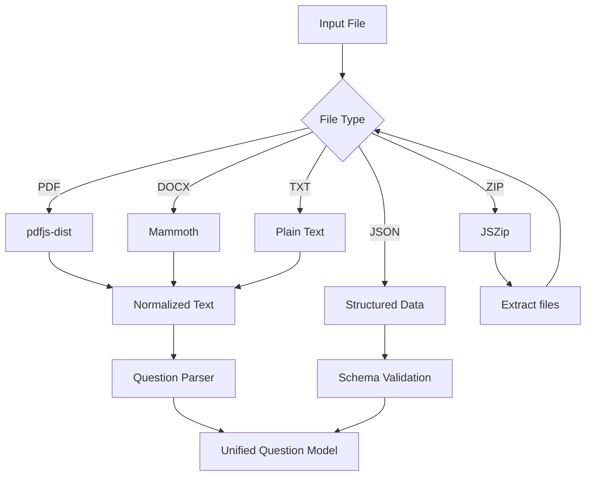

# Architecture Notes

## 1. Goal

LR-考研英语真题特训的核心不是“显示题目”，而是把阅读训练拆成一个稳定的数据流：

```text
导入 → 解析 → 结构化 → 训练 → 记录 → 分析 → 复盘
```

## 2. Front-end responsibilities

当前前端主要由三个文件承担：

- `src/app.js`：训练流程、页面交互、状态更新；
- `src/data.js`：题目与导入数据相关处理；
- `src/style.css`：针对平板横屏优化的视觉布局。

这是一个较轻量的实现方式。随着项目继续增长，后续更合理的重构方向是拆分为：

```text
src/
├── core/
│   ├── parser/
│   ├── storage/
│   └── analytics/
├── features/
│   ├── practice/
│   ├── annotation/
│   └── statistics/
└── ui/
```

## 3. Import pipeline

不同文件类型最终应转换成统一的数据模型。



值得继续改进的点：

- parser 与 UI 解耦；
- 对异常格式提供明确错误信息；
- 对导入结果增加预览和人工修正；
- 为 parser 增加固定测试样例。

## 4. Android packaging

项目使用 Capacitor 将 Web 应用封装为 Android 应用。

这种方案的优点：

- Web UI 迭代快；
- 同一份核心代码可以在浏览器和 Android 中运行；
- GitHub Actions 可以统一构建 APK。

代价是需要注意：

- Android WebView 文件权限；
- 大文件解析时的内存压力；
- 平板不同分辨率下的响应式布局；
- Web 层与原生层之间的能力边界。

## 5. CI/CD

CI 目标是保证任何一次有效提交都能在干净环境下完成：

```text
Checkout
→ Node.js 22
→ Java 21
→ Android SDK
→ npm ci
→ npm run build
→ Capacitor sync
→ Gradle assembleDebug
→ Upload APK artifact
```

这让“能在我电脑上运行”升级成“能被第三方复现”。

## 6. Engineering lessons

这个项目适合继续练习以下工程问题：

1. 大文件解析的性能控制；
2. 本地数据结构升级；
3. 多格式输入的容错；
4. UI 状态与持久化状态分离；
5. CI 环境下 Android 构建的稳定性；
6. 从个人工具向可维护项目演进时的模块化重构。
